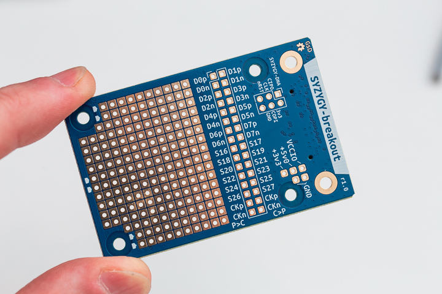
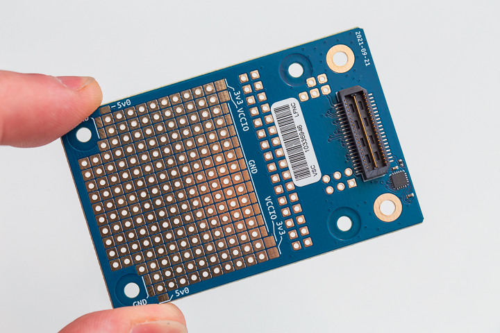

# SYZYGY breakout

SYZYGY is an FPGA expansion standard for medium to high speed interfaces. Learn more and check out the specifications here: [https://syzygyfpga.io/](https://syzygyfpga.io/)

> Note that the attiny44A populated on boards from the GroupGets campaign are delivered blank.

---

## What is it

- A breakout with all 32 I/O pins broken out to a 0.1" header. 
- A small prototyping area is also provided.
- attiny44a provided to enable SYZYGY DNA features.

## Photos

:-------------------------:|:-------------------------:
  |  

## Prototyping area

The prototyping area is set up like a traditional breadboard layout, if you examine the back of the board you can see tracks that run between the 0.1" prototyping holes.
You can also see these details in the KiCad design files.

Available on the back of the board is various power rails that are available to "jumper" across to the prototyping area.

## Attiny44A Firmware

The attiny44A is fitted to provide SYZYGY DNA features, a mechanism that SYZYGY controllers can poll to determine what pods are connected, and their VCCIO range etc.

Currently, the firmware for this hasn't been developed/tested yet. This feature also requires the controller (E.g. ButterStick) to have a mechanism to poll the pods for this info.
